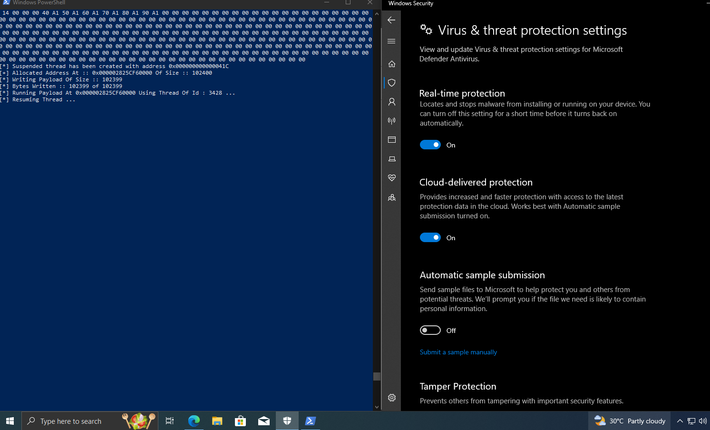
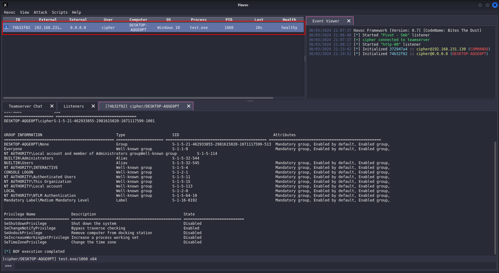

# ChaiLdr - AV Evasive Payload Loader

A simple shellcode loader built with the concepts of Malware development I have learnt till now.

## Features 

- Indirect syscalls with SysWhispers3 - jumper_randomized
- QueueUserAPC Injection
- HTTP/S shellcode staging
- Execution delay using API Hammering
- IAT Camouflage
- API Hashing

## Testing with Havoc and the Latest Windows Defender

---

## **NOTE**
> 
> **CRT Library Removal :** I tried a lot to get the payload working with CRT Library removed and make it independent with custom intrinsic functions for - memcpy, memset, rand, stand, etc, but ended up with a lot of crashes and after hours of debugging couldn't get it working, I'll incorporate it into a dev branch soon enough. I have used minicrt, MiniCRT, etc for references but still couldn't get it to work.  
>
> **Shellcode Encryption :** The shellcode is fetched from a remote server, providing SSL support. I haven't incorporated any shellcode encryption, when used with Havoc, Havoc provides Sleep encryption.
>
> **Why not HellsGate? :** HellGate incorporated only direct syscalls, HellsHall uses indirect syscalls, but I'm still learning that and will build my custom implementation of it in the future
>
> **EDR Evasion? :** This is a simple shellcode payload loader, it can bypass a lot of antivirus software and some EDRs but the techniques it incorporates aren't the best, so as I keep learning I'll make better loaders! 

